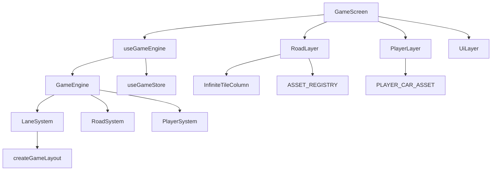

# Phase 1 Architecture — Playable World Foundation

## Scope

Phase 1 establishes modular engine architecture and renders a scrollable world:

- ✅ Game screen (Road, Player, UI layers)
- ✅ Infinite scrolling road (grass, sidewalk, center road, dividers)
- ✅ Player in center lane (static)
- ✅ Lane system (3 lanes, position math)
- ✅ Asset registry (player + obstacle configs; obstacles not rendered)
- ✅ GameEngine + RoadSystem + PlayerSystem + LaneSystem
- ✅ Zustand status store (Ready / Playing / Paused)

**Explicitly excluded:** controls, lane movement, obstacles, collision, scoring, difficulty, audio, haptics, persistence, decorations.

## Module Graph

## Key Files

| File | Role |
|------|------|
| `src/game/engine/GameEngine.ts` | rAF loop, system lifecycle |
| `src/game/systems/lane/LaneSystem.ts` | Lane centers and bounds |
| `src/game/systems/road/RoadSystem.ts` | Scroll offset updates |
| `src/game/systems/player/PlayerSystem.ts` | Player snapshot |
| `src/game/utils/layout.ts` | Screen → `GameLayout` + road regions |
| `src/game/assets/asset-registry.ts` | Central asset lookup |
| `src/game/store/game-store.ts` | Zustand status store |
| `src/components/lane-game/screens/GameScreen.tsx` | Screen composition |

## Infinite Scroll Algorithm

1. `RoadSystem.updateScroll()` accumulates pixel offset in a ref and writes to `scrollY` shared value.
2. Each tile column renders `ceil(screenHeight / tileSize) + 4` tiles.
3. Animated container applies `translateY: -(scrollY % tileSize)`.
4. When offset exceeds one tile height, modulo wrapping creates seamless loop.

## Phase 2 Preview

Next phase adds left/right control buttons and animated lane switching using the same `LaneSystem` — intended to validate lane width, road proportions, and car size before any gameplay systems.
