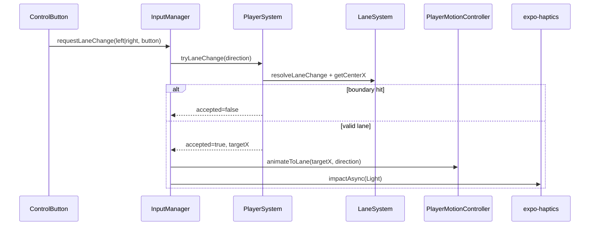

# Phase 2 Architecture — Player Controls & Lane Switching

## Scope

Phase 2 adds lane-based player movement with on-screen controls:

- ✅ Left / right arrow buttons (bottom corners, safe area aware)
- ✅ `InputManager` — single entry point for all lane input
- ✅ `PlayerSystem.tryLaneChange()` — boundary-safe lane logic
- ✅ `PlayerMotionController` — Reanimated X + tilt animations
- ✅ Haptic feedback on successful lane change
- ✅ Button press scale animation

**Excluded:** obstacles, collision, scoring, difficulty, audio SFX, persistence, decorations, game over, swipe (architecture ready).

## Input Flow

## Lane System

| Lane | Index | Position |
|------|-------|----------|
| Left | 0 | `roadLeft + 50` |
| Center | 1 | `roadLeft + 150` (spawn) |
| Right | 2 | `roadLeft + 250` |

- `resolveLaneChange()` clamps at boundaries — invalid taps are ignored
- Authoritative lane index updates immediately in `PlayerSystem` ref
- Visual X animates via `PlayerMotionController` — logical and visual stay in sync

## Animation Architecture

### Lane X transition

- Duration: `180ms` (`LANE_CONSTANTS.LANE_SWITCH_DURATION_MS`)
- Easing: `Easing.out(Easing.cubic)`
- **Interrupt-safe:** `cancelAnimation(x)` then `withTiming` from current X to new lane center
- Rapid taps retarget mid-animation — player always settles exactly on lane center

### Car tilt

- ±`8°` (`PLAYER_MOTION_CONSTANTS.TILT_DEGREES`)
- `withSequence`: tilt in 90ms → return upright 90ms
- Applied via `rotateZ` on `PlayerCar` animated view

### Button press

- Scale to `0.92` on press in, restore on press out
- Separate shared value per button — no parent rerenders

## Performance Decisions

| Concern | Solution |
|---------|----------|
| Frame-by-frame position | Reanimated `SharedValue` for X, Y, tilt |
| Lane logic | Refs in `PlayerSystem`, not React state |
| Control rerenders | `React.memo` + stable `useCallback` handlers |
| Input debounce | `50ms` in `InputManager` (prevents double-fire, not movement queue) |
| Engine coupling | `inputManagerRef` passed to controls — no context provider |

## Future Swipe Support

`InputManager.requestLaneChange(direction, source)` accepts `'button' | 'swipe'`.
A future `PanGestureHandler` will call the same method with `source: 'swipe'` — zero duplicated lane logic.

## Key Files

| File | Role |
|------|------|
| `src/game/systems/input/InputManager.ts` | Input routing, debounce, haptics |
| `src/game/systems/player/PlayerSystem.ts` | Lane state + `tryLaneChange` |
| `src/game/systems/player/PlayerMotionController.ts` | Reanimated X + tilt |
| `src/components/lane-game/controls/ControlButton.tsx` | Memoized arrow button |
| `src/components/lane-game/layers/ControlsLayer.tsx` | Bottom-left / bottom-right layout |
